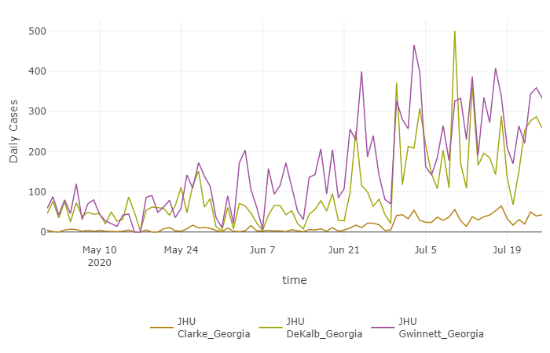

**Welcome to the William Norfolk first committee meeting website!**   

Due to the fact that COVId-19 has substantially limited our ability to meet in person, I thought it would be easier to generate a short informational website to provide some background and research updates prior to our Zoom meeting. The subsections below provide details about my program of study, dissertation research, and any additional projects I have or currently am contributing to. Note all images can be enlarged by clicking on the picture to view a lightbox.

# Committee and Program Information

Information | Name
------------- | -------------
Student | William Norfolk
Degree Program | PhD Environmental Health Science
Adviser | Dr. Erin Lipp (EHS)
Committee Member | Dr. Franklin Leach (EHS)
Committee Member | Dr. Jim Porter (Ecology)
Committee Member | Dr. Bill Fitt (Ecology)

# Program of Study
The table below shows a breakdown of my tentative program of study for the completion of my degree. The table includes all coursework completed from Fall 2019 to Summer 2020 as well as any additional required courses to be completed in future semesters (indicated by _italics_).

Requirement | Course Code | Course Taken | Credits | Semester Completed | Grade Received
------------- | ------------- | ------------- | ------------- | ------------- | -------------
Intro to EHS | EHSC 7010 | Intro to EHS | 3 | Fall 2019 | A
Public Health | PBHL 7100 | Public Health | 3 | Spring 2020 | A
Adv Topics EHS | EHSC 8010 | Adv Topics EHS | 3 | Fall 2020 | _upcoming_
Responsible Conduct of Research | GRSC 8550 | Responsible Conduct of Research | 1 | Spring 2020 | A
Proseminar EHS | EHSC 8050 | Proseminar EHS | 1 | Spring 2020 | A
EHS Grad Seminar (3x semesters) | EHSC 8030 | EHS Grad Seminar|  1 (each semester) | Fall 2019, Spring 2020, Fall 2020 | SA, SA, _upcoming_
Biostatistics | EPID/BIOS 8XXX | Modern Applied Data Analysis (EPID 8060E) | 3 | Fall 2019 | A
Dissertation | EHSC 9300 | Dissertation | 3 | _final semester_ | _upcoming_
Elective | EHSC 8XXX | Environmental Genomics (EHSC 8460) | 3 | Fall 2019 | A
Elective | EHSC 8XXX | Adv Environmental Chemistry (EHSC 8650) | 4 | Spring 2020 | A
Elective | _Any_ 8XXX | Computational Workshop (ECOL 8540) | 4 | Summer 2020 | _pending posting_
EHS Exit Seminar | EHSC 8150 | EHS Exit Seminar | 1 | _final semester_ | _upcoming_

#### Course Summary  
* Total credits completed to date: 54  
* Total credits completed to date at 8000 Level: 18 (excluding Doctoral Research)  
* Total credits completed to date at 7000 Level: 6  
* Total doctoral research credits completed (to date): 30  
* **Courses Remaining:** Advanced Topics EHS, EHS Graduate Seminar (1x semester), Dissertation, and EHS Exit Seminar  
* **Anticipated semester for remaining course completion:** Fall 2020 (excluding Exit Seminar and Dissertation)


# Research Updates: Chapter 1 {.tabset}

### Abiotic tolerance characterization of _Vibrio alginolyticus_ and the implications for disease transmission.

## Summary/Motivation
Anthropogenic climate change and habitat disruption have drastically altered the abiotic factors that mediate coastal ecosystems. Alterations to these abiotic factors can have cascading effects on the microbial ecology of the system and can promote the proliferation of potentially harmful bacterial species when optimal conditions are met. _Vibrio_ is a ubiquitous taxon of heterotrophic marine bacteria commonly associated with human and environmental (non-human) diseases. A highly adaptive genus, _Vibrio_ are known to respond synergistically to increases in water temperature and nutrient availability (particularly iron). Optimal growth conditions can create _Vibrio_ "blooms" and thus increase the risk of infection. _Vibrio alginolyticus_ is an emerging pathogen within the taxon known to cause human illness via wound/ear infection and environmental illness in filter feeding marine invertebrates (primarily associated with the shellfish industry). Research is needed to characterize the physiological limitations of _V. alginolyticus_ to better understand the abiotic conditions that are favorable to the development/transmission of disease. 

This work aims to characterize the viable and optimal abiotic condition levels for _V. alginolyticus_ at a range of temperature, salinity, and nutrient availability. Characterizations will be measured _in situ_ using an optical density meter to construct bacterial growth curves that illustrate changes in the growth kinetics of _V. alginolyticus_ at the given condition. The results of these characterizations will be used to develop a working model of _V. alginolyticus_ disease risk.

## Progress Thus Far
For this research, a prototype optical density meter was constructed to optimize and automate the measurement of growth kinetics. Pictured below (Fig 1), the prototype meter runs on the Arduino platform (a commercially available open source electronics prototyping board) to collect real-time growth data from a liquid bacterial culture. An LED light source (600nm) passes a beam of light through the growing sample, and the transmitted light is quantified by a detector downstream. The level of transmitted light is logarithmically related to the bacterial concentration according to Beer-Lampert's Law and can be used to quantify growth kinetics metrics when measured over a standard growing period. 

Currently, the meter has been built and optimized for usage in the laboratory. A tangential evaluation/methods development study was conducted to test the efficacy of the meter measuring the growth of _Vibrio alginolyticus_, _Salmonella_, and _Escherichia coli_. The results of this study indicate that the prototype is a viable measurement device for bacterial optical density and is capable to detecting variations in growth kinetics between species. Three representative growth curves generated from the meter can be viewed below (Fig 2). 

```{r protometer, fig.cap="Figure 1: Prototype Arduino-based optical density meter. Disassembled prototype meter components.", fig.hold='hold', out.height = "40%", out.width = "40%", fig.align='center', fig.show='hold', echo=FALSE}
knitr::include_graphics(c("./protometer.jpg", "./proto_dis.jpg"))
```

```{r curves, fig.cap="Figure 2: .", fig.hold='hold', out.height = "40%", out.width = "40%", echo=FALSE}
#knitr::include_graphics(c("./ecoli_10.png", "./protometer.jpg", "./protometer.jpg"))
```

## Upcoming Work
Following the completion of the evaluation study (tentatively beginning in August 2020), the prototype meter will be employed to measure the growth tolerance of _V. alginolyticus_ as described above. Temperature responses will be measured at 2$^\circ$ intervals from 20$^\circ$-40$^\circ$, salinity responses will be measured at 4ppt intervals from 0ppt-40ppt, and nutrient responses will be measured for minimal-enriched media (specific levels pending). Combinatory investigations of the optimal levels for each factor will also be measured to determine if additive responses are observed. From these data a semi-quantitative risk scale will be developed to classify the potential for _V. alginolyticus_ infection in relation to ambient abiotic conditions. 

Pilot results (from an earlier version of the prototype) suggest the meter is sensitive enough to record subtle differences in bacterial growth kinetics in response to changing temperatures (Fig 3).  

```{r combo curves, fig.cap="Figure 3: Pilot growth meter outputs for Vibrio alginolyticus at 30C, 35C and 38C temperatures. Plot one shows the raw data points generated from the meter and plot two shows the best fit for each scenario.", fig.hold='hold', out.height = "50%", out.width = "50%", fig.show='hold', echo=FALSE}
knitr::include_graphics(c("combo1.png", "combo2.png"))
```

## Project Deliverables
#### Research Goals
1. Develop a real-time optical density meter using the Arduino platform.  
2. Determine the optimal and lethal abiotic limits of _V. alginolyticus_ for temperature, salinity, and nutrient content.  
3. Develop a working model of _V. alginolyticus_ infection risk based on abiotic conditions.  

#### Proposed Publications 
1. Methods development and evaluation of the prototype optical density meter.  
_Manuscript in progress_  
_Target journal: PeerJ_    
2. Physiological characterization of _V. alginolyticus_.


# Research Updates: Chapter 2 {.tabset}
### Foodborne transmission of _Vibrio alginolyticus_ via ingestion of colonized zooplankon.

## Summary/Motivation
As naturally occurring bacteria, _Vibrio_ are frequently implicated as the causative pathogens for various marine diseases. Numerous studies have shown that _Vibrio_ spp. act as opportunistic secondary pathogens infecting exposed lesions in organisms ranging from humans to corals. However, few studies have attempted to characterize the mechanistic acquisition of pathogenic _Vibro_ into healthy host organisms. It is known that _Vibrio cholerae_ preferentially attach to the exoskeletons of chitinous zooplankton for shelter and to metabolize chitin. When ingested, _V. cholerae_-bearing zooplankton can transmit pathogenic dose of the bacterium to an otherwise healthy host. It has been hypothesized that this transmission pathway may be characteristic to all members of the family _Vibrionaceae_ however further research is needed to confirm the behavior in other _Vibrio_ spp. 

The objective of this research is to determine if _V. alginolyticus_ has the ability to 1) attach to chitinous zooplankton and 2) transmit to a healthy host via ingestion. To track movement and transmission, a green fluorescent protein-tagged (GFP) strain _V. alginolyticus_ will be cultivated from in-house _Vibrio_ stocks and a GFP-tagged strain of _E.coli_ (courtesy of Dr. Eric Stabb) using a tri-parental mating assay. Brine shrimp _Artemia_ spp. will be cultivated _in situ_ and seeded with an overnight culture of GFP-tagged _V. alginolyticus_ to promote bacterial attachment then subsequently fed to pale sea anemones _(Exiaptasia pallida)_. Following ingestion, _E. pallida_ samples will be culled and dissected to isolate the oral disk/tentacles and gastrovascular cavities. Dissections will be homogenized and viewed using fluorescent microscopy to confirm the presence of GFP-tagged _V. alginolyticus_. _Vibrio_ concentrations will be quantified using culture-based plate count methods as well as quantitative polymerase chain reaction (qPCR) to determine the bacterial burden of each dissected subsection. 

## Progress Thus Far

To confirm the viability of _V. alginolyticus_ attachment prior to the start of the controlled anemone feeding study, a pilot attachment study was conducted using culture-based methods to measure the attachment affinity of _V. alginolyticus_ to _Artemia_ (Fig 4). Laboratory-reared _Artemia_ cultures were hatched in sterile marine microcosms, seeded with _V. alginolyticus_ (~10^6^ and ~10^4^ bacteria per mL), and allowed to attach for a period of 6 hours. Following attachment, _Artemia_ were filter out of the microcosms, washed in artificial sea water (ASW), homogenized, and plated on to thiosulfate citrate bile-salts sucrose agar (TCBS) for the selective isolation of _Vibrio_ spp. 

```{r artemia culture, fig.cap="Figure 4: Marine microcosms with hatching Artemia for the pilot Vibrio alginolyticus attachment study.", fig.hold='hold', out.height = "80%", out.width = "80%", fig.show='hold', fig.align='center',echo=FALSE}
knitr::include_graphics("./test.png")
```

The results of this study showed that culturable _Vibrio_ were recoverable from homogenized _Artemia_ which suggests that _V. alginolyticus_ has the ability to attach to _Artemia_ opportunistically (Fig 5). Control cultures of unseeded _Artemia_ and seeded wash ASW (ASW used to remove any liquid suspended _Vibrio_) showed no bacterial growth indicating that any homogenate-cultured _Vibrio_ were attached to _Artemia_ from the seeded samples. These results provide the first preliminary evidence that zooplanktonic attachment is not solely a characteristic of _V. cholerae_ and may be a commonplace characteristic within the taxon. 


```{r artemia, fig.cap="Figure 5: Vibrio alginolyticus attachment pilot study initial results. Left: Artemia homogenate seeded with 1mL of overnight V. alginolyticus culture. Right: Unseeded Artemia homogenate.", fig.hold='hold', out.height = "50%", out.width = "50%", fig.show='hold', fig.align='center',echo=FALSE}
knitr::include_graphics(c("./vib_culture.png", "./control_culture.png"))
```

## Upcoming Work

Based on the results of the initial pilot study, a larger culture-based _V. alginolyticus-Artemia_ attachment study is planned to confirm the results of the pilot work and optimize bacterial seeding concentrations. _Artemia_ cultures will be seeded with bacterial concentrations ranging from 10^8^ per mL to 10^2^, homogenized, and quantified on TCBS plates to determine the optimal concentration for inoculation. Pending the arrival of the GFP-tagged _E. coli_ (to be used for plasmid transfer) an additional microscopy-based pilot study will be conducted in concert with culture work to confirm the attachment of _V. alginolyticus_ via fluorescent tags. 

Following the completion of attachment experiments, a controlled feeding study will be used to confirm foodborne transmission of _V. alginolyticus_. _E. pallida_ samples will be transferred to individual microcosms and fed Artemia bearing GFP-tagged _V. alginolyticus_. Feeding exposure is planned to be a simple water introduction of the _Artemia_ to the microcosm, however, modifications may be used to promote ingestion if the anemones fail to feed. Following a 12-24 hour feeding exposure (varying time replicates will be tested with seperate microcosms) anemones will be collected from the microcosms and 1) kept live/intact for whole organism viewing via inverted fluorescent microscopy and 2) culled and dissected for homogenization and subsequent viewing using traditional fluorescent microscopy. 

Additional sub-projects may stem from the results of the attachment and/or feeding study on an as-needed basis to investigate different ecological attributes of the association between _V. alginolyticus_ and zooplankton.

## Project Deliverables

#### Research Goals
1. Develop a working strain of GPF-tagged _V. alginolyticus_ for movement and transmission tracking.  
2. Develop a set of marine microcosms desinged to house _Artemia_ spp. and _E. pallida_ for feeding and attachment studies.  
3. Determine if _V. alginolyticus_ has the ability to attach to _Artemia_.  
4. Determine if attached _V. alginolyticus_ can transmit to an apparently healthy host via ingestion of _Artemia_.  

#### Proposed Publications 
1. Foodborne transmission of _V. alginolyticus_.  
_preliminary research in progress_    
_target journals: PeerJ, Coral Reefs, or similar_  
**Potential to seperate the publication into two seperate papers focusing on 1) _V. alginolyticus_ attachment and 2) Foodborne transmission of attached bacteria; depending on the results of the first stage of experimentation.


# Research Updates: Chapter 3 {.tabset}
### Chemical investigation and characterization of _Vibrio alginolyticus_ extracellular polymeric substances (EPSs) and microbial volatile organic compounds (MVOCs). 

## Summary/Motivation

At a time where emerging pathogens are at the forefront of attention, a proper understanding of bacterial physiology is imperative to the successful management of novel pathogenic species. Recent increases in _V. alginolyticus_ infection prevalence warrant further investigation into the bacterium to determine pathogenicity traits and adaptive mechanisms. Despite being one of the most abundant species of _Vibrio_, few studies have investigated the specific physiological characteristics of _V. alginolyticus_ and thus there is a needed for baseline level data on the bacterium. 

Laboratory observations (Lipp Lab) have indicated that certain strains of _V. alginolyticus_ secrete a thick mucoid extracellular polymeric substance (EPS) that we hypothesize may serve as an adaptive trait in the environment. It is unknown if these EPSs are survival-based, virulence indicators, or representative of another unknown trait of the bacterium. Characterization of these EPSs would provide baseline data on the physiological and adaptive responses of the bacterium in the environment. Furthermore, it is known that _Vibrio_ rapidly respond to increased nutrient availability exhibiting a "boom-bust cycle" of growth and decline. A chemical characterization of the microbial volatile organic compounds (MVOCs) produced during log phase growth of _V. alginolyticus_ would provide novel insight into the metabolic characteristics of the bacterium and could be used to compare metabolic differences at high versus low nutrient availability. 

## Progress Thus Far

_V. alginolyticus_ collection, isolation, and culture-based qualitative characterization has been previously completed by fellow members of the Lipp Lab. Frozen stocks of isolates of interest have been prepared and stored at -80$^\circ$C for future usage. 

```{r valg_pic, fig.cap=".", fig.hold='hold', out.height = "80%", out.width = "80%", fig.show='hold', fig.align='center',echo=FALSE}
#knitr::include_graphics("./test.png")
```

## Upcoming Work

The specific methods and objectives of this experiment are currently in a planning stage. We hope to begin experimental design and/or pilot research in the Fall 2020 semester.

## Project Deliverables

#### Research Goals
1. A baseline chemical characterization of _V. alginolyticus_ EPSs and MVOCs.  
_Due to the exploratory nature of this research, it is likely that additional research objectives will be identified as preliminary data is collected._  

#### Proposed Publications 
1. Chemical characterization of _V. alginolyticus_ extracellular polymeric substances and microbial volatile organic compounds.  
_The specific objectives of this proposed publication are subject to changed based on the results of preliminary investigations._ 

# Additional Project Contributions {.tabset}

## O^3^ Disinfection

In the early stages of the first COVID-19 lockdown the Lipp Lab and Glenn Lab (EHS) were recruited to conduct a brief evaluation study testing the efficacy of ozone disinfection of personal protective equipment for the elimination of SARS CoV-2. The objective of this work was to determine if a Zono (a commercially available ozone-based disinfection cabinet) was capable of reducing the viral load of contaminated N95 masks to facilitate reuse in hospitals or other essential facilities. Small clippings of N95 mask material were seeded with laboratory grown MS2 coliphage (a surrogate for SARS CoV-2) and exposed to standard and heavy Zono O^3^ treatment. Following treatment, the clippings were eluted into beef extract and plated using a soft agar overly method to obtain direct counts of MS2 plaque forming units (PFUs). The results suggest that ozone disinfection is capable of reducing the viral load of N95 masks and could potentially be a viable option for the sterilization and reuse of PPE (Fig #). 

**Project Notes**  
Research Note Manuscript: _in progress_  
Target Journals: Frontiers in Microbiology, BMC Microbiology, and Clinical Microbiology and Infection  

```{r zono, fig.cap="Figure #: Viral burden of Zono-treated N95 mask components.", fig.hold='hold', out.height = "100%", out.width = "100%", fig.show='hold', fig.align='center',echo=FALSE}
knitr::include_graphics("./zonoresults.jpg")
```

## COVID Working Group

In April I joined the Center for the Ecology of Infectious Diseases (CEID) coronavirus working group to assist with the development of data visualizations for the evolving COVID-19 pandemic (Fig #). To date I have contributed to (and continue to update) the design and coding of the CEID COVID [COVID tracker](https://www.covid19.uga.edu/tracker.html). Currently I am working to develop a similar R-based shiny application for the visualization of forecast model data to be released in the near future following peer review. 

```{r ceid, fig.cap="Figure #: Non-reactive image capture from the CEID COVID-19 tracker comparing COVID-19 daily cases for Clarke, DeKalb, and Gwinnett counties.", fig.hold='hold', out.height = "80%", out.width = "80%", fig.show='hold', fig.align='center',echo=FALSE}

```

## COVID Wastewater

Currently, the Lipp Lab is engaged in an ongoing COVID monitoring project designed to assess the population-level burden of the disease using wastewater monitoring. The objective of this research is to design and evaluate the methods for viral concentration, extraction, and quantification to determine the viral shedding patterns of Athens, GA. Wastewater influent composite samples are collected weekly from the North Oconee, Middle Oconee, and Cedar Creek water reclamation facilities, aliquoted/concentrated for viral extraction, and quantified using RT-qPCR. Thus far we have successfully developed a pipeline for the extraction and quantification of SARS CoV-2 in wastewater and intend to utilize these methods as a component of a larger Athens-based COVID study to progress over the course of the upcoming year. 

## FDA Small Farms

Throughout the summer 2020 semester I have been working to fulfill the requirements of a previously funded FDA grant to investigate the presence and source of pathogenic microorganisms on small organic farms in Georgia. My research consists of a monthly field sampling of local farms to collect, water (well, irrigation, and surface), soil, air, and produce. All samples are screened for the presence of _Salmonella_, _Listeria_, Shiga toxin-producing _E. coli_ (STEC), enteric viruses, and _Cyclospora_. Microbes are isolated using a combination of selective filtration (modified Moore swabs and dead-end ultrafiltration), culture-based microbiological techniques, and molecular analyses. 

Due to laboratory limitations and COVID disruption, my work on this project consists of sample collection, filtration, pre-processing/storage, and culture-based confirmation of _Salmonella_ and _Listeria_. All remaining samples are sent to the FDA for processing or are concentrated and stored frozen until a later date. 

```{r okra, fig.cap="Figure #: Okra fields from a participating organic farm .", fig.hold='hold', out.height = "80%", out.width = "80%", fig.show='hold', fig.align='center',echo=FALSE}
knitr::include_graphics("./okra.png")
```

# Funding and Awards 

Name | Semester | Status | Amount Received
------------- | ------------- | ------------- | ------------- 
John Scarno Memorial Scholarship | Fall 2019 | Not Funded | NA
UGA IIRG | Spring 2020 | Funded | $2,000
EHS Graduate Research Showcase | Spring 2020 | 3^rd^ Place | $300
Orlin K. Fletcher Memorial Scholarship | Summer 2020 | Pending | Pending

# Committee Meeting Agenda 

#### Introductions 
#### Program of Study
#### Proposed Research Plan
#### Current Research Updates
#### Prospectus
#### Comprehensive Exams 
#### Additional Topics of Interest
